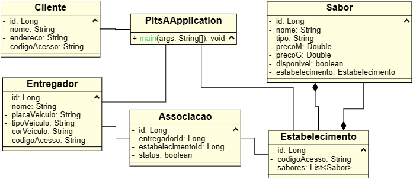
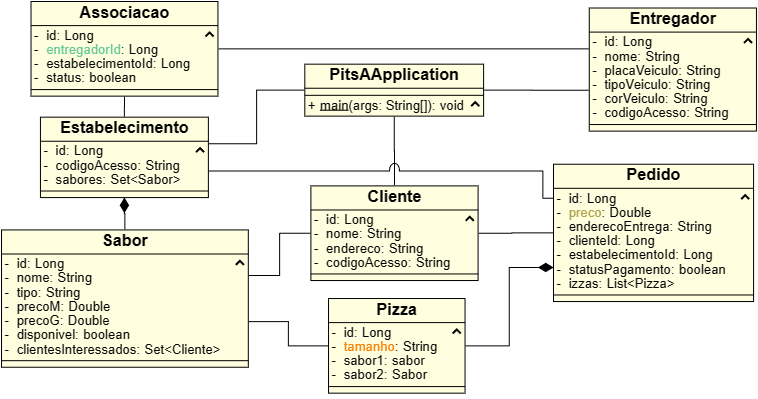
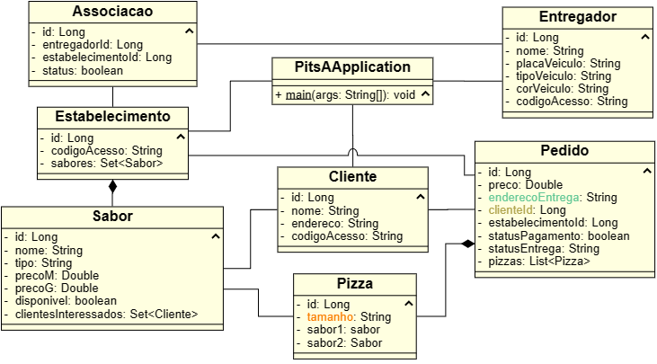
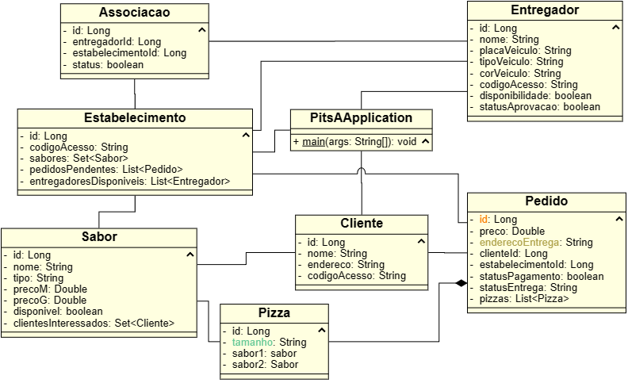

# 🍕 Pits A

Recentemente, diversas empresas do ramo alimentício têm se desvinculado dos grandes aplicativos de delivery. As causas
dessa tendência são diversas e vão desde a transformação no modo de operação de cada estabelecimento, até as taxas
abusivas das grandes plataformas.

Porém, em 2023, simplesmente não é viável voltar ao modo de trabalho “pré-Ifood”... Foi por isso que a pizzaria Pits A
decidiu desenvolver seu próprio aplicativo de delivery. E adivinha só… vocês foram escolhidos para ajudar!

### 🔗 Endereços Úteis

- [Swagger](http://localhost:8080/swagger-ui/index.html)
- [H2 Console](http://localhost:8080/h2-console)

## 🤝 Grupo 3

- 121110708 - Catarina Ramalho dos Santos ([@catarinaramalho](https://github.com/catarinaramalho))
- 121110359 - Eli Pedro Cordeiro da Silva ([@elipcs](https://github.com/elipcs))
- 121110769 - Jônatas Tavares dos Santos ([@JonatasTavaresS](https://github.com/JonatasTavaresS))
- 121110295 - Lucas de Medeiros Soares ([@lucasmedss](https://github.com/lucasmedss))
- 121110281 - Lucas Leones Costa dos Santos ([@lleones](https://github.com/lleones))

## 📑 User Stories já implementadas

### 1ª Etapa: USs 01-07 (09/05/2023)

Documento da etapa 1:
[Google Docs](https://docs.google.com/document/d/1Z1PlNvylBsgnuWbqO3OmWrIy2PM0W75tJiZGvRxeyas/edit?usp=sharing)

- [x] **US1:** Eu, enquanto administrador do sistema , quero utilizar o sistema para criar, editar e remover um
  estabelecimento;
- [x] **US2:** Eu, enquanto cliente, quero utilizar o sistema para me cadastrar como cliente do sistema. Mais
  detalhadamente, deve ser possível criar, ler, editar e remover clientes;
- [x] **US3:** Eu, enquanto funcionário(a) terceirizado(a), quero utilizar o sistema para me cadastrar como entregador(
  a) do sistema. Mais detalhadamente, deve ser possível criar, ler, editar e remover entregadores;
- [x] **US4:** Eu, enquanto funcionário(a) terceirizado(a), quero utilizar o sistema para me associar como entregador(a)
  de um estabelecimento;
- [x] **US5:** Eu, enquanto estabelecimento, quero utilizar o sistema para aprovar ou rejeitar entregadores do
  estabelecimento;
- [x] **US6:** Eu, enquanto estabelecimento, quero utilizar o sistema para o CRUD dos sabores de pizza vendidos pelo
  estabelecimento. Mais detalhadamente, deve ser possível criar, ler, editar e remover sabores;
- [x] **US7:** Eu, enquanto cliente, quero visualizar o cardápio de um estabelecimento;

### 2ª Etapa: USs 08-11 (30/05/2023)

Documento da etapa 2:
[Google Docs](https://docs.google.com/document/d/1PTA8RlR87_ynEMZl82-MOvU16_jNXm3d3pJ9zIHIwo0/edit?usp=sharing)

- [x] **US8:** Eu, enquanto cliente, quero utilizar o sistema para fazer pedidos de pizza a um estabelecimento. Mais
  detalhadamente, deve ser possível criar, ler, editar e remover pedidos;
- [x] **US9:** Eu, enquanto estabelecimento, quero modificar a disponibilidade dos sabores do cardápio. Mais
  detalhadamente, deve ser possível visualizar e editar a disponibilidade dos sabores de pizza — dado que, nem sempre,
  todos os produtos estão disponíveis;
- [x] **US10:** Eu, enquanto cliente, quero demonstrar interesse em sabores de pizza que não estão disponíveis no
  momento;
- [x] **US11:** Eu, enquanto estabelecimento, quero disponibilizar diferentes meios de pagamento para os pedidos, tal
  que cada meio de pagamento também gere descontos distintos;

### 3ª Etapa: USs 12-17 (06/06/2023)

Documento da etapa 3:
[Google Docs](https://docs.google.com/document/d/1Je2O1NmpXsgmPoP1U4JmC7pUQo9NP1RaWNzUWAVEHrg/edit?usp=sharing)

- [x] **US12:** Eu, enquanto estabelecimento, quero que o sistema garanta a corretude nas mudanças de status dos
  pedidos;
- [x] **US13:** Eu, enquanto cliente, quero ser notificado(a) quando meus pedidos estiverem em rota e, por medidas de
  segurança, quero ser informado(a) com o nome do(a) entregador(a) responsável pela entrega e os detalhes sobre seu
  veículo. A notificação deve ser representada como uma mensagem no terminal da aplicação (print), indicando o motivo e
  quem está recebendo a notificação;
- [x] **US14:** Eu, enquanto cliente, quero ser responsável por confirmar a entrega dos meus pedidos;
- [x] **US15:** Eu, enquanto estabelecimento, quero ser notificado(a) sempre que o status de um pedido for modificado
  para “Pedido entregue”. A notificação deve ser representada como uma mensagem no terminal da aplicação (print),
  indicando o motivo e quem está recebendo a notificação;
- [x] **US16:** Eu, enquanto cliente, quero ter a possibilidade de cancelar um pedido que fiz no estabelecimento;
- [x] **US17:** Eu, enquanto cliente, quero poder verificar os pedidos que já realizei no estabelecimento;

### 4ª Etapa: USs 12-17 (19/06/2023)

Documento da etapa 4:
[Google Docs](https://docs.google.com/document/d/1nKsjnTvEPCdrOVvCPE-wZq8e8lM5cnm2x6bcUdI4HEk/edit?usp=sharing)

- [x] **US18:** Eu, enquanto funcionário(a) terceirizado(a), desejo definir se estou disponível (ou não) para realizar
  as entregas do estabelecimento;
- [x] **US19:** Eu, enquanto funcionário(a), gostaria que o sistema atribuísse automaticamente as entregas dos pedidos
  com status “Pedido Pronto” a um(a) entregador(a) que esteja disponível para realizar entregas;
- [x] **US20:** Eu, enquanto cliente, quero ser notificado(a) quando meu pedido não puder ser atribuído para entrega
  devido à indisponibilidade de entregadores. A notificação deve ser representada como uma mensagem no terminal da
  aplicação (print), indicando o motivo e quem está recebendo a notificação;

